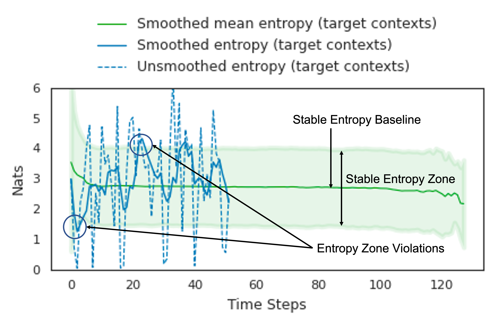

# The Stable Entropy Hypothesis and Entropy-Aware Decoding
This repository is the official implementation of [The Stable Entropy Hypothesis and Entropy Aware Decoding](https://arxiv.org/abs/<tobefilled>). 

<p align="center">

</p>

This paper introduces the concept of the stable entropy baseline and the stable entropy zone, and then use these definitions to posit the stable entropy hypothesis. Finally, we leverage the stable entropy hypothesis to propose an entropy-aware decoding method that generates fluent and non degenerate text in open-ended generation settings while acting greedily most of the time.

### The Stable Entropy Zone:
We define the **stable entropy baseline** as the smoothed mean entropy of the conditional distribution of the model under target context distribution, i.e., under target data. We posit that the stable entropy baseline is flat across the length of the generation. 

Next, we define an area around the** stable entropy baseline** spanned by its standard deviation as the **stable entropy zone**. We hypothesize that the stable entropy zone is narrow and flat across tasks, models and domains. 

### The Stable Entropy Hypothesis:
We posit that any decoding algorithm that results in entropy of the model being "contained" with-in the stable entropy zone would result in more natural-sounding human-like generations.

## Requirements
To install requirements:

```setup
python -m venv ${HOME}/envs/ead
source ${HOME}/envs/ead/bin/activate

pip install -r requirements.txt
```

## Stable Entropy Analysis:
The stable entropy analysis is presented in ipython notebook [here](stable_entropy_analysis/stable_entropy_analysis.ipynb): 

```stable_entropy_analysis/stable_entropy_analysis.ipynb```

To generate data for correlation analysis, run:
```bash
./text_completion/wiki/generate_for_corr_analysis.sh
```

To compile the results in csv file, run:
```bash
./text_completion/compile_corr_analysis.py --directory data/wiki_rankgen/corr_analysis/gpt2_xl/
```
